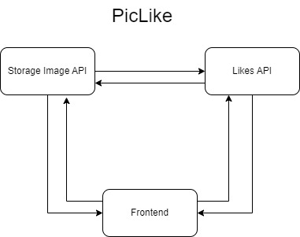
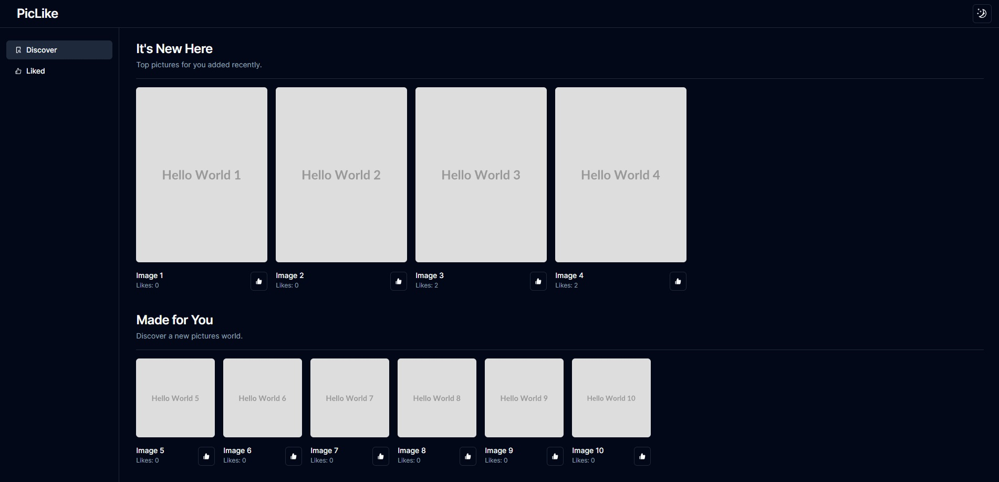

# PicLike

A `Full Stack` project aimed at viewing and liking images, through an image-providing API built in `.NET 8` and another one for liking images using `Node.js`.

<p align=start>
  
</p>

In addition, a responsive frontend developed in `Next.js v14` with `TypeScript` and `TailwindCSS`.

<p align=start>
  
</p>

## Running the Project

Clone the repository:

Via HTTPS

```bash
https://github.com/guirdy/pic-like.git
```
or

Via SSH

```bash
git clone https://github.com/guirdy/pic-like.git
```

Next steps in the README of the [Image Storage API](https://github.com/guirdy/pic-like/tree/master/ImageStorageAPI).

<h4 align=center>Developed by <a href="https://www.linkedin.com/in/guirdy/">Guilherme Leandro</a> 💻</h4>